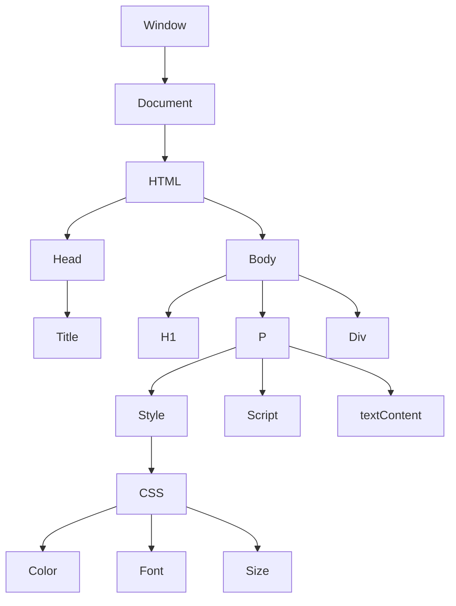

# DOM
Document Object Model
Elements from html are represented as objects in the DOM. The DOM is a tree structure where each node is an object representing a part of the document.
These objects can be manipulated using JavaScript to change the content, structure, and style of a web page dynamically.

eg.
```html
<h1 id="title">Hello World</h1>
```

```
{
  "tagName": "H1",
  "id": "title",
  "textContent": "Hello DOM"
}
```

```javascript
const titleElement = window.document.getElementById('title');
titleElement.textContent = 'Hello DOM';
```

window is the global object in browsers, and it contains the document object, which represents the entire HTML document. The document object provides methods to access and manipulate elements in the DOM.
```js
window.alert('Hello World');
window.open('https://www.abhinavprakash.me');
window.document.getElementById('title').textContent = 'Hello DOM';
```

window prefix is optional, so you can also write:
```js
alert('Hello World');
open('https://www.abhinavprakash.me');
document.getElementById('title').textContent = 'Hello DOM';
```

document is the object that represents the HTML document loaded in the browser. It provides various methods and properties to interact with the DOM, such as selecting elements, creating new elements, and modifying existing ones.

## DOM Tree Structure
The DOM tree structure represents the hierarchical relationship between elements in an HTML document. Each element is a node in the tree, and the relationships between nodes are represented as parent-child relationships. The root of the tree is the document object, which contains the HTML element as its child. The HTML element contains the head and body elements, which in turn contain other elements like title, h1, p, div, etc.



Difference between id.innerHTML, id.textContent and id.innerText:
`id.innerHTML` returns the HTML content of an element, including any nested HTML tags. It allows you to get or set the HTML structure within an element.
`id.textContent` returns the text content of an element, excluding any HTML tags. It retrieves or sets the plain text within an element, ignoring any formatting or nested elements.
`id.innerText` returns the visible text content of an element, taking into account CSS styles and layout. It retrieves or sets the text that is actually rendered on the page, considering factors like visibility and line breaks.

## Other DOM Methods
- `document.getElementById(id)`: Selects an element by its unique ID.
- `document.getElementsByClassName(className)`: Selects all elements with the specified class name.
- `document.getElementsByTagName(tagName)`: Selects all elements with the specified tag name.
- `document.querySelector(selector)`: Selects the first element that matches the specified CSS selector.
- `document.querySelectorAll(selector)`: Selects all elements that match the specified CSS selector.

## CRUD Operations in DOM
- Create: You can create new elements using `document.createElement(tagName)` and append them to the DOM using methods like `appendChild()` or `insertBefore()`.
- Read: You can read the content of elements using properties like `textContent`, `innerHTML`, or `innerText`, as well as methods like `getElementById()`, `getElementsByClassName()`, and `querySelector()`.
- Update: You can update the content or attributes of elements using properties like `textContent`, `innerHTML`, or `setAttribute()`, as well as methods like `classList.add()` or `classList.remove()`.
- Delete: You can remove elements from the DOM using methods like `removeChild()` or `remove()`.